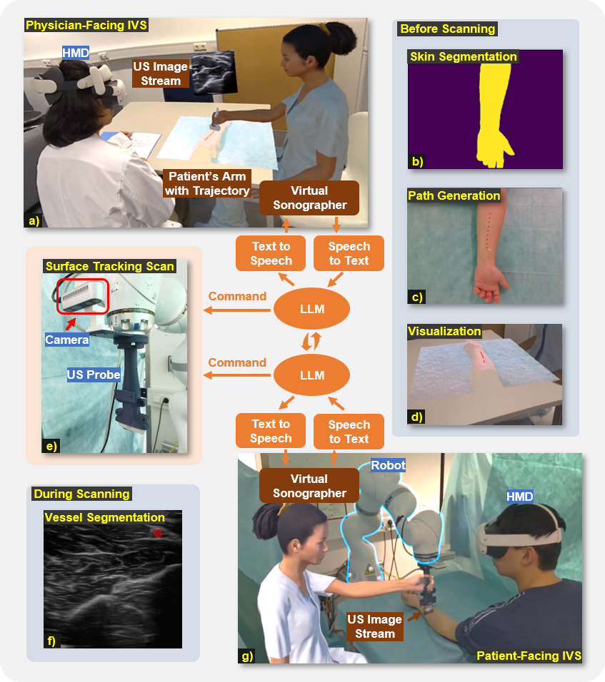

# Intelligent Virtual Sonographer (IVS): Enhancing Physician-Robot-Patient Communication (MICCAI 2025 Paper)

## Abstract
This work introduces a conversational virtual agent in Extended Reality that bridges real-time interaction between physicians, robotic ultrasound systems, and patients by communicating professionally with physicians while providing empathetic explanations to patients. The agent actively controls the robotic system through physician commands and integrates LLM-powered dialogue with speech processing and robotic control to enhance efficiency and accessibility.

## System Architecture 

	

## Code will be released soon!

## Disclaimer
Due to licensing issues with some third-party plugins and libraries, we are unable to share certain components on GitHub. Specifically, the following plugins used in the original paper are not included in this repository:

- [**Final-IK**](https://assetstore.unity.com/packages/tools/animation/final-ik-14290).
- [**SALSA LipSync Suite tool**](https://assetstore.unity.com/packages/tools/animation/salsa-lipsync-suite-148442)

If you require these plugins for your work, please refer to the official sources for obtaining them.

## Cite Us

To be updated

